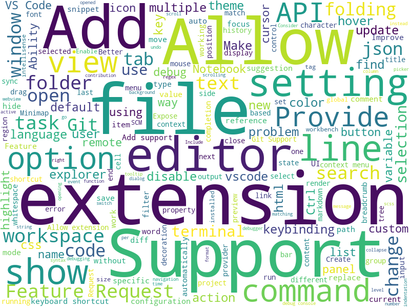

# 软件需求工程 Lab1

## 小组成员
+ 171860636 陈昊东 25%  
+ 171860622 吴晓阳 25%
+ 181860144 张智 25%
+ 181860019 冯文轩 25%

## 实验目的
对VSCode进行需求抽取及分类

## 实验方法
+ 使用爬虫对VSCode Github仓库中Issue List进行爬取以获得原始数据
+ 使用词云分析提取关键词，根据关键词对需求进行分类与分析

## 实验过程及结果

### 数据获取
#### 数据源
实验所用到的数据通过VSCode Github仓库中的issue中提取，每一个issue都附带有多个标签，所获取的内容就是带有***feature-request***标签的issue标题。因为其标题的高度概括性，issue只爬取了其标题，对于其详细解释和衍生的讨论则没有被考虑在内。

#### 程序相关
爬虫程序通过java编写，使用`HttpClient`类进行数据的获取，使用`JSoup`工具进行数据的处理并转换成可以被访问的`Document`类。此后，对于涉及到issue标题的标签，使用css选择器的`id[|=issue]`来提取出**id**以**issue**开头的所有标签的内容，并储存在txt文件中。

### 需求分析与分类

#### 数据预处理
在词云分析前，需要忽略数据中所含有的非关键词，即连词、介词、冠词等出现频率高，但本身不含关键语义信息的词。

#### 分析分类
通过python wordcloud库进行词云分析

其中，忽略诸如Add,support,provide,change等非功能词，将需求数据根据关键字分类可得到需求列表，下面列举部分热门需求

##### 文件相关，以file,folder为关键字
+ Send `vscode.workspace.onDidCreateFiles` events for folders
+ A command to open a workspace and navigate to a file in it
+ Multi root workspace - Variable for the current file's workspace directory
+ Upload file (on save) using diff strategy
+ Overwrite files after upload completed
+ Allow quick open to open multiple files
+ Specify one or both files as immutable when using --diff
+ Show all files of all window tabs
+ Add option to only show file name (not full file path) when hovering a file
+ Syntax highlighting for backup/sample files
+ Get File Name from user via Explorer (sideclick -> new file) method instead of InputBox in Extension

文件相关需求主要涉及到
1. 文件显示，包括基于差异的显示和基于文件类型的显示
2. 文件操作，包括打开、创建及删除灵活性及快捷方式
3. 文件与workspace的灵活相关性

##### 编辑器相关，以editor为关键字
+ Support detail text in settings editor dropdown
+ Custom Editors should have ability to use normal diff view
+ "Close All Editor Groups" should not close pinned tabs
+ Editor Find doesn't support args passed via keybinding
+ Allow for camel case matches in editor history
+ Allow editor title to be specified when using --diff option
+ Hovering over breadcrumbs should jump in the editor similar to arrow keys
+ Allow to group editor tabs
+ Separate Open Editors from Explorer (thus creating a Vertical Tab Bar)
+ Show editors stacked

编辑器相关需求主要涉及到
1. 编辑器可显示内容的增强
2. 多个编辑器之间的可组合性

##### 扩展相关，以extension为关键字
+ Extensions: Support extension installation/activation policies
+ Badges for extension activity bar icons
+ Watchlist Of Extensions
+ Provide extensions with a persistent logging channel
+ Change Language Mode drop-down should allow filtering by file extension
+ Explore API implications for allowing multiple notebook extensions to share the same file format
+ Provide API for extensions to move cursor without affecting history
+ please allow a filter on not installed extensions too
+ Allow grouping extension on user side.
+ Call natiive logging APIs when debugging in the extension host
+ Add Education extension category

扩展相关需求主要涉及到
1. 扩展的管理灵活性，包括扩展安装与卸载方式、扩展及其依赖扩展的管理以及扩展的选择性启用
2. 开放更多的API供扩展使用
3. 扩展开发所需要的debug工具
4. 将部分扩展作为VSCode原生功能提供

##### 设置相关，以setting，option为关键字
+ Consider having a setting to allow tasks and debug to format files when running/debugging
+ Change default setting: "Preview Mode" from enabled to disabled
+ setting UI: support color settings
+ Add setting to disable 'retry as sudo'
+ Setting to follow to running cells in a notebook
+ Add "Replace Remote" to Settings Sync Turn On options
+ setting to hide explorer views per workspace
+ Allow font setting overrides per theme
+ Option to change the title of the integrated terminal in vscode?
+ Add option to make task panel persistent (not accidentally closing it by any key press)
+ Add option to collapse/hide stdout lines in file w/ language support

设置相关需求主要涉及到
1. 设置多设备同步
2. 开放更多可设置属性
3. 修改设置的默认值

#### 总结
可见在VSCode的Github Issue Tracker中提取的需求主要为用户提出的功能需求，涉及的功能较小，主要在于提高软件的易用性和可扩展性，需求描述本身存在一定的模糊性和二义性。