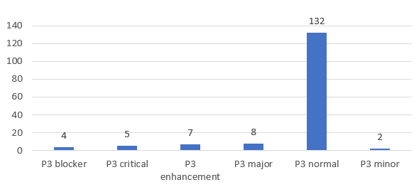
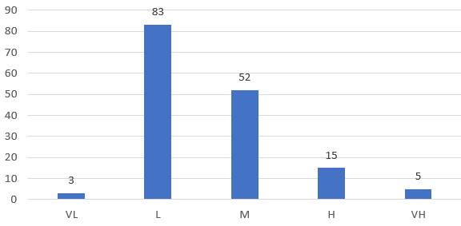
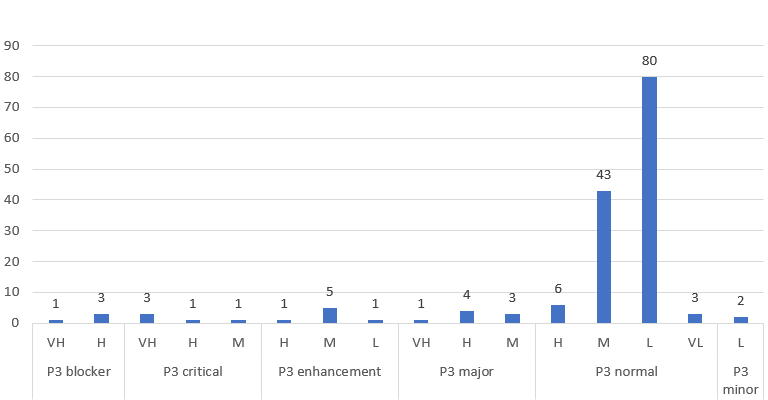

# 软件需求工程 Lab1

## 小组成员
+ 171860636 陈昊东 25%  
+ 171860622 吴晓阳 25%
+ 181860144 张智 25%
+ 181860019 冯文轩 25%

## 实验目的
对eclipse的缺陷报告作为软件需求进行优先级排序

## 实验方法
将缺陷分为5级(Very High, High, Medium, Low, Very Low)，人工进行排序，排序考虑：
+ BUG对使用的影响程度(70%)
+ 用户呼声(20%)
+ 修复BUG所需要的改动大小(10%)

## 实验过程及结果

### 数据获取
FIXME WXY

### 实验结果

实验对158条需求进行了排序，排序结果见result.csv  

##### Eclipse排序

##### 我们的排序

##### 对比

##### 总结
我们的手工排序结果基本符合Eclipse给出的优先级，但仍然有部分结果误差较大，其中原因在于
+ 我们排序基于的信息仅为BUG的摘要，缺少BUG的具体信息，导致判断不准确
+ 我们对于Eclipse的使用仅涉及其一部分功能，故在判断BUG严重性时主观使用体验会有较大影响
+ 我们并未参与Eclipse的开发，对于出现的BUG，我们很难判断BUG对于Eclipse自身而言的严重性，只能从使用者角度评判
